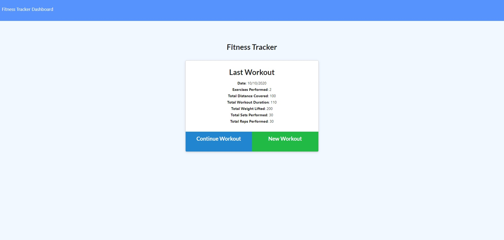
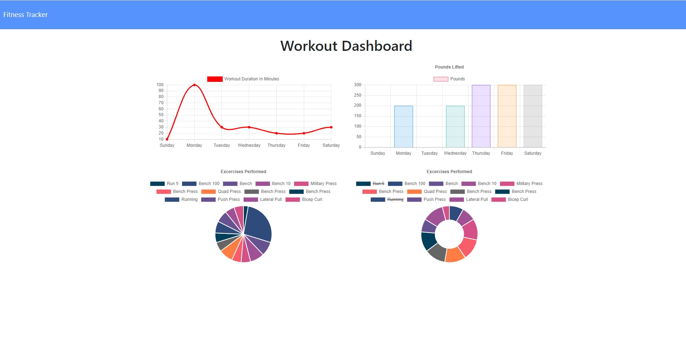

# Workout Tracker

## Description

This is a simple application that allows the user to keep track of their workouts. The user can create new workouts and add exercises to it. Each exercise can either be classified as Cardio or Resistance. The user can also edit their last workout to add additional exercises. The app keeps track of the user workouts in the backend DB which is powered by MongoDB, a NoSQL database. It uses schemas to define the structure of the documents that can be stored in the collection. Having the workout history stored in the backend, the app is able to present a dashboard of the user's workout history using different charts.

## Instructions

The app is deployed using heroku [here](https://nameless-depths-55689.herokuapp.com/). Simply navigate to the URL!
